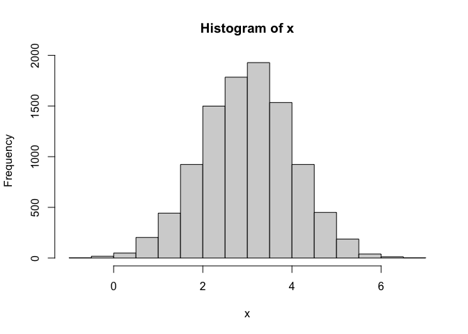
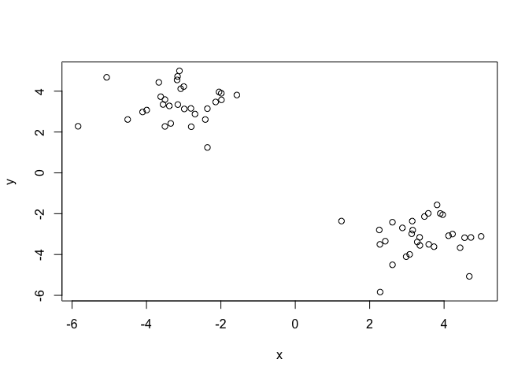
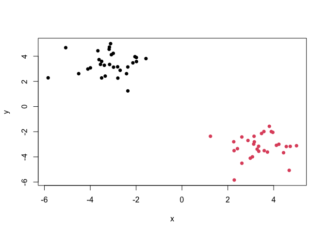
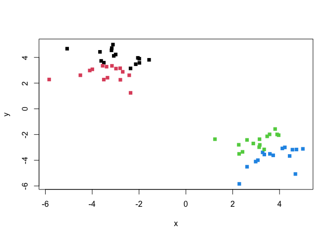
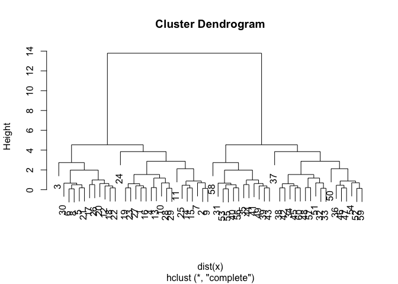
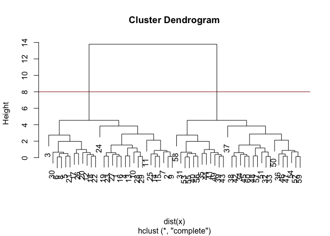
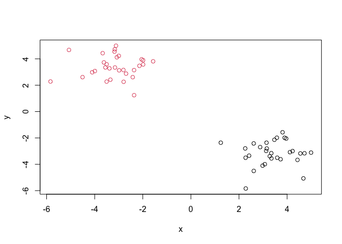
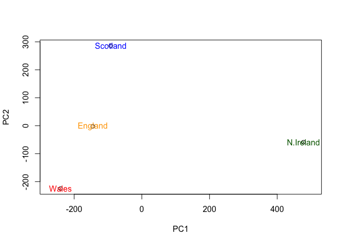

# class07
Adithi Kumar

# Clustering

We will start today’s lab with clustering methods, in particular
so-called K-means. The main function for this in R is ‘kmeans()’ .

Let’s try it on some made up data where we know what the answer should
be.

``` r
x <- rnorm(10000, mean = 3, ) 
hist(x) 
```



60 points

``` r
tmp <- c(rnorm(30, mean = 3), rnorm(30, mean = -3) )
#makes two colums: x = tmp and y = reverse of tmp 
x <- cbind(x=tmp, y = rev(tmp)) 
head(x)
```

                x         y
    [1,] 3.349845 -3.554292
    [2,] 4.119343 -3.079397
    [3,] 1.242110 -2.361397
    [4,] 2.419842 -3.347520
    [5,] 3.574982 -1.984752
    [6,] 3.962815 -2.049943

We can pass this to the bast ‘plot()’ function to be quick

``` r
plot(x) 
```



``` r
# for kmeans() centers = number of clusters & nstart is the number of iterations you want to run ( the more the better)
k <- kmeans(x, centers = 2, nstart =20) 
k
```

    K-means clustering with 2 clusters of sizes 30, 30

    Cluster means:
              x         y
    1 -3.164756  3.393254
    2  3.393254 -3.164756

    Clustering vector:
     [1] 2 2 2 2 2 2 2 2 2 2 2 2 2 2 2 2 2 2 2 2 2 2 2 2 2 2 2 2 2 2 1 1 1 1 1 1 1 1
    [39] 1 1 1 1 1 1 1 1 1 1 1 1 1 1 1 1 1 1 1 1 1 1

    Within cluster sum of squares by cluster:
    [1] 46.96196 46.96196
     (between_SS / total_SS =  93.2 %)

    Available components:

    [1] "cluster"      "centers"      "totss"        "withinss"     "tot.withinss"
    [6] "betweenss"    "size"         "iter"         "ifault"      

\>Q1: How many points are in each cluster?

``` r
k$size
```

    [1] 30 30

\>Q2: Cluster membership?

``` r
#which points are assigned to which cluster
k$cluster
```

     [1] 2 2 2 2 2 2 2 2 2 2 2 2 2 2 2 2 2 2 2 2 2 2 2 2 2 2 2 2 2 2 1 1 1 1 1 1 1 1
    [39] 1 1 1 1 1 1 1 1 1 1 1 1 1 1 1 1 1 1 1 1 1 1

\>Q3: Cluster Centers?

``` r
# what are the cluster centers
k$centers
```

              x         y
    1 -3.164756  3.393254
    2  3.393254 -3.164756

\>Q4: Plot my clustering results

``` r
# color by cluster by using cluster membership k$cluster
plot(x, col = k$cluster, pch =16)
```



\>Q5: Cluster the data again into 4 groups and plot the results.

``` r
# cluster x into 4 groups 
k4 <- kmeans(x, centers =4, nstart= 20)  
# plot with color by cluster using k4$cluster
plot(x, col =k4$cluster, pch = 15)
```



L-means is very popular mostly because it is fast and relatively
straightforward to tun and understand. It has a big limitation in that
you need to tell it how many groups (k, or centers) you want.

# Hierarchical Clustering

Th main function in base R is called ‘hclust()’ . You cane to pass it in
a “distance matrix” not just your input data.

You can generate a distance matrix with the ‘dist()’ function.

``` r
hc <- hclust(dist(x)) 
hc 
```


    Call:
    hclust(d = dist(x))

    Cluster method   : complete 
    Distance         : euclidean 
    Number of objects: 60 

``` r
plot (hc) 
```



To find the clusters (cluster membership vector) from a ‘hclust()’
results we can “cut” the tree at a certain height that we like.

``` r
plot(hc)  
# draw line at desired height with abline
abline(h=8, col = "darkred") 
```



``` r
# actually assign membership using 'cutree()' by assigning desired height 
grps <- cutree(hc, h = 8)
```

``` r
table(grps)
```

    grps
     1  2 
    30 30 

Q6: Plot our hclust results.

``` r
plot(x, col=grps)
```



# PCA

## UK food data

``` r
url <- "https://tinyurl.com/UK-foods" 
y <- read.csv(url) 
```

**Q1**. How many rows and columns are in your new data frame named `x`?
What R functions could you use to answer this questions?

``` r
dim(y)
```

    [1] 17  5

``` r
## Preview the first 6 rows 
head(y) 
```

                   X England Wales Scotland N.Ireland
    1         Cheese     105   103      103        66
    2  Carcass_meat      245   227      242       267
    3    Other_meat      685   803      750       586
    4           Fish     147   160      122        93
    5 Fats_and_oils      193   235      184       209
    6         Sugars     156   175      147       139

``` r
## Rename so X is not the first column 
rownames(y) <- y[,1] 
y <- y[,-1] 
head(y) 
```

                   England Wales Scotland N.Ireland
    Cheese             105   103      103        66
    Carcass_meat       245   227      242       267
    Other_meat         685   803      750       586
    Fish               147   160      122        93
    Fats_and_oils      193   235      184       209
    Sugars             156   175      147       139

``` r
dim(y)
```

    [1] 17  4

Q2: Which approach to solving the ‘row-names problem’ mentioned above do
you prefer and why? Is one approach more robust than another under
certain circumstances?

I definitely like the second approach ( x \<- read.csv (url, row.names
=1)). With the first approach, if I re-ran the same command, I would
lose an additional column which can be difficult to fix or even notice
if I wasn’t careful. Reading it properly from the beginning (like what
the second approach does) will help avoid this problem altogether.

``` r
barplot(as.matrix(y), beside=T, col=rainbow(nrow(y)))
```


Q3: Changing what optional argument in the above barplot() function
results in the following plot?

``` r
barplot(as.matrix(y), beside=F, col=rainbow(nrow(y)))
```


By making the argument ‘beside= F’, the columns of height will be
portrayed as stacked columns.

**Q5**: Generating all pairwise plots may help somewhat. Can you make
sense of the following code and resulting figure? What does it mean if a
given point lies on the diagonal for a given plot?

``` r
pairs(y, col=rainbow(10), pch=16)
```


Each plot from the resulting figure shows scatter-plots of a country
vs. another country. Each colored point is a specific food. The points
on the straight diagonal indicate that the specific food is consumed
very similarly in both country. If the point is off of the diagonal
line, this indicates that the specific food is NOT consumed similarly in
both countries. Each point is a specific food.

Q6: What is the main differences between N. Ireland and the other
countries of the UK in terms of this data-set?

The plots that show N. Ireland vs. any of the other countries all have
more off-diagonal points than any of the other countries. This indicates
that there are more foods that are eaten differently between N. Ireland
and the other countries of the UK than any other countries.

## Principal Component Analysis (PCA)

PCA can help us make sense of these types of data sets. Let’s see how it
works!

The main function in “base” R is ‘prcomp()’ In this case, we want to
first take the transpose of out input ‘x’ so the columns are the food
types and the countries are the rows.

``` r
head (t(y))
```

              Cheese Carcass_meat  Other_meat  Fish Fats_and_oils  Sugars
    England      105           245         685  147            193    156
    Wales        103           227         803  160            235    175
    Scotland     103           242         750  122            184    147
    N.Ireland     66           267         586   93            209    139
              Fresh_potatoes  Fresh_Veg  Other_Veg  Processed_potatoes 
    England               720        253        488                 198
    Wales                 874        265        570                 203
    Scotland              566        171        418                 220
    N.Ireland            1033        143        355                 187
              Processed_Veg  Fresh_fruit  Cereals  Beverages Soft_drinks 
    England              360         1102     1472        57         1374
    Wales                365         1137     1582        73         1256
    Scotland             337          957     1462        53         1572
    N.Ireland            334          674     1494        47         1506
              Alcoholic_drinks  Confectionery 
    England                 375             54
    Wales                   475             64
    Scotland                458             62
    N.Ireland               135             41

``` r
pca <- prcomp(t(y)) 
summary(pca)
```

    Importance of components:
                                PC1      PC2      PC3       PC4
    Standard deviation     324.1502 212.7478 73.87622 3.176e-14
    Proportion of Variance   0.6744   0.2905  0.03503 0.000e+00
    Cumulative Proportion    0.6744   0.9650  1.00000 1.000e+00

``` r
pca$x
```

                     PC1         PC2        PC3           PC4
    England   -144.99315   -2.532999 105.768945 -4.894696e-14
    Wales     -240.52915 -224.646925 -56.475555  5.700024e-13
    Scotland   -91.86934  286.081786 -44.415495 -7.460785e-13
    N.Ireland  477.39164  -58.901862  -4.877895  2.321303e-13

**Q7**. Complete the code below to generate a plot of PC1 vs PC2. The
second line adds text labels over the data points.

``` r
# Plot PC1 vs PC2
plot( pca$x[,1], pca$x[,2], xlab="PC1", ylab="PC2", xlim=c(-270,500))
text(pca$x[,1], pca$x[,2], colnames(y))
```


**Q8.** Customize your plot so that the colors of the country names
match the colors in our UK and Ireland map and table at start of this
document.

``` r
plot( pca$x[,1], pca$x[,2], xlab="PC1", ylab="PC2", xlim=c(-270,500))
text(pca$x[,1], pca$x[,2], colnames(y),  col = c("orange", "red", "blue", "darkgreen"))
```



We can use the square of pca\$sdec to calculate how much variation in
the ordinal data each PCs

The “loadings” tell us how much the original variables (in our case the
foods) contribute to the new variables (sx. the PCs)

``` r
v <- round( pca$sdev^2/sum(pca$sdev^2) * 100 )
v
```

    [1] 67 29  4  0

``` r
z <- summary(pca)
z$importance
```

                                 PC1       PC2      PC3          PC4
    Standard deviation     324.15019 212.74780 73.87622 3.175833e-14
    Proportion of Variance   0.67444   0.29052  0.03503 0.000000e+00
    Cumulative Proportion    0.67444   0.96497  1.00000 1.000000e+00

``` r
barplot(v, xlab="Principal Component", ylab="Percent Variation")
```


``` r
head(pca$roation) 
```

    NULL

``` r
par(mar = c(10, 3, 0.35, 0)) 
barplot (pca$rotation[,1], las =2)
```


